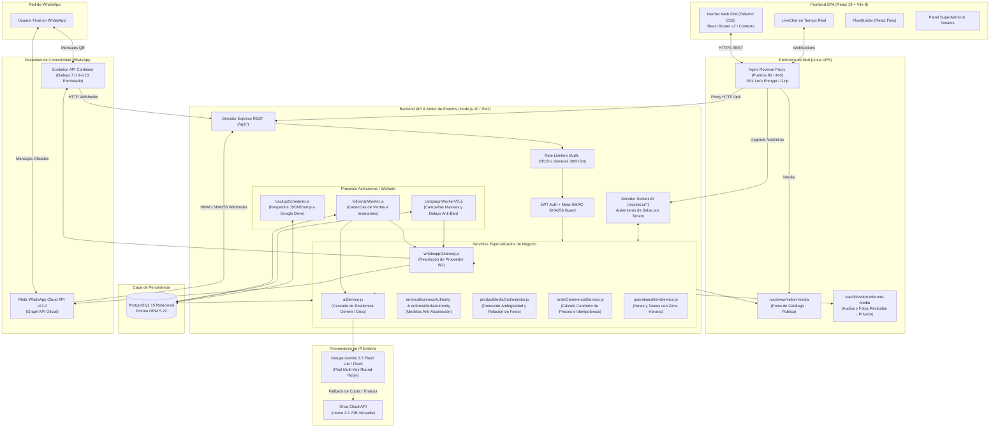
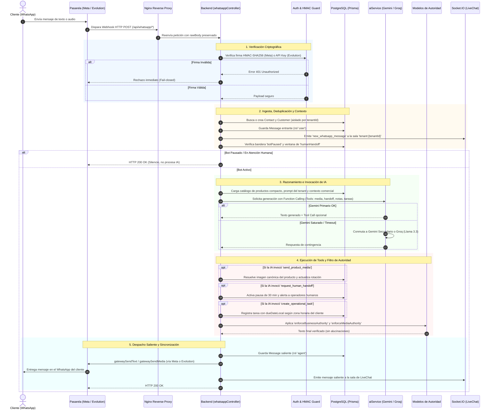

# Velion Agent — Technical Architecture Specification

**Documento de Arquitectura de Sistemas y Flujo de Datos**  
**Versión de Especificación:** 1.0.0  
**Fecha:** Septiembre 2026  

---

## 1. Visión General de la Arquitectura

Velion Agent utiliza un patrón arquitectónico de **Microservicios Modulares y Monolito Central Desacoplado**, diseñado para alta disponibilidad en comunicaciones en tiempo real, baja latencia en procesamiento de lenguaje natural y aislamiento estricto de datos en entornos B2B multitenant.

---

## 2. Componentes Técnicos Detallados

### 2.1. Frontend SPA
* **Stack:** React 19.2.7, Vite 8.1.1, Tailwind CSS 3.4.19, React Router DOM 7.18.1.
* **Componentes Visuales:**
  * Iconografía: Phosphor Icons (`@phosphor-icons/react`) y Lucide React (`lucide-react`).
  * Tipografía: Plus Jakarta Sans (`@fontsource/plus-jakarta-sans`).
  * Canvas de Automatizaciones: React Flow 11.11.4 para diseño de flujos mediante nodos y aristas interactivos.
* **Manejo de Estado y Contextos:**
  * `AuthContext`: Administra token JWT, usuario autenticado, impersonación de inquilino (`impersonatedTenantId`) y redirección según rol (`client` vs `superadmin`).
  * `UnsavedChangesContext`: Previene pérdida de datos en formularios complejos de configuración y catálogo al navegar accidentalmente.
* **Servicio API Centralizado ([`src/services/api.js`](file:///c:/Users/UserHp/Documents/Dashboard_SuperAdmin/src/services/api.js)):** Cliente fetch nativo con inyección automática de cabeceras `Authorization: Bearer <token>`, `X-Tenant-Id` e interceptores globales para errores 401.

### 2.2. Backend API & Realtime
* **Runtime:** Node.js 20 LTS (modo nativo ES Modules `"type": "module"`).
* **Framework Web:** Express 4.19.2.
* **Seguridad y Perímetro:**
  * `helmet`: Configuración de cabeceras HTTP seguras.
  * `cors`: Lista blanca estricta configurable por variable de entorno `FRONTEND_URL`.
  * `express-rate-limit`: Limitadores diferenciados (20 peticiones/15 min para endpoints de login; 300 peticiones/15 min para API general, excluyendo webhooks de WhatsApp para evitar pérdidas de mensajes).
* **WebSockets Bidireccionales (Socket.IO 4.8.3):**
  * Handshake autenticado estrictamente mediante JWT en `server.js`.
  * Aislamiento por inquilino: `socket.join('tenant:' + socket.tenantId)`. Los operadores de una empresa jamás reciben eventos ni mensajes de otra empresa.
  * Soporte de impersonación para usuarios con rol `superadmin` mediante validación en el apretón de manos (*handshake*).

### 2.3. Capa de Base de Datos y Persistencia
* **Motor:** PostgreSQL 15.
* **ORM:** Prisma Client 5.22.0.
* **Modelos Principales ([`schema.prisma`](file:///c:/Users/UserHp/Documents/Dashboard_SuperAdmin/backend_api/prisma/schema.prisma)):**
  1. `Tenant`: Datos de la empresa, logo, configuración comercial (prompts, horario de atención, cuentas bancarias, políticas de entrega), modo de mensajería múltiple y límites de tokens de IA.
  2. `User`: Cuentas con roles (`superadmin`, `client`), contraseña hasheada en bcrypt y vinculación a Tenant.
  3. `Contact`: Libreta de direcciones de WhatsApp, categorías de prospección, etiquetas y conmutador `botPaused`.
  4. `Chat`: Hilos de conversación vinculados a contactos, con estados de atención y control de pausas.
  5. `Message`: Mensajes entrantes y salientes, metadatos multimedia (`mediaType`, `mediaPath`, `mediaSize`, `mediaGroupId` para álbumes) y estado de entrega.
  6. `Product`: Catálogo comercial con precio base, precio promocional con fechas de vigencia, stock, imágenes múltiples y videos demostrativos.
  7. `Order` y `OrderItem`: Registro transaccional de pedidos con cálculo canónico de precios, dirección de despacho y estados de pago.
  8. `FollowUpSequence` y `FollowUpAttempt`: Máquina de estados para cadencias de ventas, registro de intentos, hora ancla y tokens de idempotencia.
  9. `OperationalItem`: Notas internas y tareas programadas generadas por IA o usuarios, con cálculo de vencimiento en hora local del cliente.
  10. `TenantAIUsage`: Telemetría diaria de tokens consumidos (input, output, total, tool calls, reintentos).
  11. `Campaign` y `CampaignLog`: Campañas masivas, destinatarios, recurrencia y estados de despacho.
  12. `RegisteredWhatsAppNumber`: Conexiones activas de WhatsApp, identificando si operan por `EVOLUTION` o `META`.
  13. `AutomationFlow` y `Flow`: Almacenamiento JSON de nodos y aristas de automatizaciones de React Flow.
  14. `Plan`: Definición de niveles de suscripción B2B con banderas de características (`hasCampaigns`, `hasAutomations`, `hasAdvancedMarketing`, presupuestos de tokens y límites de productos).
  15. `SystemConfig`: Parámetros globales del sistema llave-valor (credenciales globales, prompts maestros).
  16. `Alert`: Notificaciones y anomalías operativas para el SuperAdmin.

### 2.4. Motor de Inteligencia Artificial y Resiliencia
* **SDK Primario:** `@google/genai` v2.19.0 (SDK oficial actual de Google).
* **Modelos:**
  * Primario: `gemini-3.5-flash-lite` (latencia ultrabaja).
  * Secundario: `gemini-3.5-flash` (mayor capacidad de razonamiento).
  * Parámetros optimizados: `thinkingConfig: { thinkingLevel: ThinkingLevel.MINIMAL }`, tokens máximos de salida acotados a 800 para evitar dispersión conversacional.
* **Pool Multi-Key de Gemini:**
  * Rotación balanceada (*round-robin*) entre múltiples claves API de Google.
  * Aislamiento de estado por clave: detección semántica de errores (`RATE_LIMIT`, `AUTH`, `CONTEXT_TOO_LARGE`) y aplicación de tiempos de enfriamiento (*cooldowns*) por clave.
* **Fallback Nivel 3 (Groq):**
  * Si los modelos de Gemini fallan tras reintentos y rotación de claves, el sistema conmuta instantáneamente a Groq mediante el SDK de OpenAI apuntando a `llama-3.3-70b-versatile` o `qwen/qwen3.6-27b`, traduciendo las declaraciones de herramientas (*tool adapters*) automáticamente.

### 2.5. Modelos de Autoridad Deterministas (*Anti-Hallucination*)
El archivo [`whatsappController.js`](file:///c:/Users/UserHp/Documents/Dashboard_SuperAdmin/backend_api/src/controllers/whatsappController.js) contiene filtros de post-procesamiento deterministas que impiden que el LLM alucine:
* `enforceMediaAuthority`: Si la IA afirma en su texto "aquí te envío la foto" pero no existe un recurso multimedia canónico resuelto en el turno, la frase es reemplazada por una indicación verídica y neutral.
* `enforceBusinessAuthority`:
  * Si el tenant no tiene cuentas bancarias configuradas, se prohíbe ofrecer datos de pago o prometer números de cuenta.
  * Si el tenant no tiene políticas de despacho configuradas, se eliminan afirmaciones de cobertura a ciudades específicas.
  * Sanitización de tiempos: Se eliminan promesas de atención inmediata o tiempos exactos ("un asesor te responderá en 5 minutos").
  * Turno exploratorio: Si el usuario solo está consultando opciones ("¿qué modelos tienes?"), se impide forzar el avance al checkout o solicitar dirección de entrega prematuramente.

### 2.6. Conectividad WhatsApp Híbrida (Dual Gateway)
El servicio [`whatsappGateway.js`](file:///c:/Users/UserHp/Documents/Dashboard_SuperAdmin/backend_api/src/services/whatsappGateway.js) resuelve en tiempo de ejecución cómo enviar cada mensaje:
1. **Ruta Evolution API (No Oficial / QR):**
   * Se comunica vía HTTP con el contenedor Docker de Evolution API (`http://localhost:8080`).
   * Nombre de instancia parametrizado por tenant: `bot_prod_${tenantId}`.
   * Utiliza la librería Baileys con parche causal para eliminar el timeout de 60 segundos en la descarga de avatares.
2. **Ruta Meta Cloud API (Oficial):**
   * Se comunica con los servidores de Meta mediante Graph API v21.0.
   * `metaAccessToken` se almacena cifrado en base de datos con AES-256-GCM.
   * Descarga multimedia entrante mediante token efímero y envío de mensajes salientes firmado por WABA ID y Phone Number ID.

---

## 3. Flujo de Vida Completo de un Mensaje (End-to-End)

El siguiente diagrama detalla la secuencia exacta que sigue un mensaje desde que es emitido por un usuario en WhatsApp hasta la respuesta automatizada de la plataforma:

---

## 4. Background Workers (Trabajadores en Segundo Plano)

El backend incorpora 3 trabajadores autónomos que se inicializan automáticamente al levantar el servidor con PM2 ([`serverConfig.js`](file:///c:/Users/UserHp/Documents/Dashboard_SuperAdmin/backend_api/src/config/serverConfig.js)):

1. **Follow-Up Cadence Worker ([`followUpWorker.js`](file:///c:/Users/UserHp/Documents/Dashboard_SuperAdmin/backend_api/src/services/followUpWorker.js)):**
   - Ejecuta un bucle periódico cada 60 segundos buscando secuencias con estado `SCHEDULED` y `nextRunAt <= now`.
   - Utiliza bloqueo atómico a nivel de base de datos (`claimedAt`) para evitar despachos duplicados en caso de reinicios.
   - En modo `ENFORCE`, consulta a [`followUpDecisionService.js`](file:///c:/Users/UserHp/Documents/Dashboard_SuperAdmin/backend_api/src/services/followUpDecisionService.js) (interpretación semántica con Gemini) para validar si corresponde reanudar la venta, aplazarla (*defer*) o transferirla a un humano.
   - Respeta estrictamente los horarios silenciosos (*quiet hours*: no enviar mensajes de madrugada según la zona horaria del tenant).
2. **Campaign Worker V2 ([`campaignWorkerV2.js`](file:///c:/Users/UserHp/Documents/Dashboard_SuperAdmin/backend_api/src/services/campaignWorkerV2.js)):**
   - Procesa campañas de difusión masiva programadas.
   - Introduce un retardo estocástico aleatorio (`delayMin` a `delayMax`, típicamente de 5 a 15 segundos) entre cada contacto para prevenir la activación de algoritmos de detección de spam de WhatsApp.
   - Maneja la recurrencia automática quincenal y mensual calculando la fecha del siguiente ciclo (`nextRunAt`).
3. **Backup Scheduler ([`backupScheduler.js`](file:///c:/Users/UserHp/Documents/Dashboard_SuperAdmin/backend_api/src/services/backupScheduler.js)):**
   - Orquesta respaldos de PostgreSQL según la frecuencia configurada por el SuperAdmin (`daily`, `weekly`, `monthly`).
   - Genera volcados en formato JSON y DUMP y, si está habilitado, los transmite a Google Drive mediante una cuenta de servicio autorizada.
