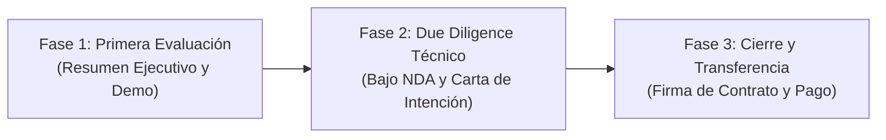

# Velion Agent — Information Disclosure Strategy for Wallpay (First Round)

**Estrategia Gradual de Revelación de Información para Adquisición de Software (M&A)**  
**Objetivo:** Maximizar el interés y la credibilidad técnica de Wallpay mientras se protegen la propiedad intelectual, la seguridad de la infraestructura y el poder de negociación del vendedor.  

---

## 1. Clasificación Tripartita de Información

Para una negociación empresarial estructurada, la información no debe entregarse en un solo bloque. Se divide en tres fases secuenciales:

---

## 2. Categoría 1: ENVIAR AHORA (Primera Ronda de Evaluación)

Estos documentos fueron redactados específicamente para ser compartidos **de inmediato** con los socios, el CTO y el equipo de inversión de Wallpay. No contienen secretos, ni IPs reales, ni rutas locales, ni vulnerabilidades:

1. **`VELION_EXECUTIVE_ONE_PAGER.md`:**
   - *Destinatario:* Socios fundadores, directores y evaluadores comerciales.
   - *Propósito:* Explicar qué es Velion, qué problema resuelve, diferenciadores y estado en 2 minutos.
2. **`VELION_TECHNICAL_SUMMARY.md`:**
   - *Destinatario:* CTO, Líder Técnico y Arquitectos de Software.
   - *Propósito:* Presentar la arquitectura de alto nivel, stack verificado, métricas de código (42k LOC aplicación, 45k LOC tests), modelos de autoridad, resiliencia y limitaciones honestas.
3. **Invitación a Demostración en Vivo (15 minutos):**
   - *Propósito:* Ejecutar la demo guiada siguiendo el guión oficial (`DEMO_SCRIPT.md`) y, opcionalmente, entregar credenciales de 48 horas para el tenant demo aislado.

---

## 3. Categoría 2: ENVIAR SOLO BAJO REVISIÓN TÉCNICA POSTERIOR (Due Diligence Formal / Bajo NDA)

Estos documentos profundizan en los detalles internos de implementación. Deben compartirse **únicamente cuando Wallpay formalice su interés** (ej. tras la demo o con un acuerdo de confidencialidad / NDA firmado):

1. **`ARCHITECTURE.md`:**
   - Contiene diagramas de secuencia detallados, ciclo de vida del mensaje, workers asíncronos y estructura interna de controladores.
2. **`API_REFERENCE.md` y `openapi.json`:**
   - Catálogo exhaustivo de los 80+ endpoints REST. Ideal para que el equipo de desarrollo de Wallpay evalúe la facilidad de integración con su pasarela de pagos.
3. **`SECURITY_OVERVIEW.md`:**
   - Detalle de cifrado AES-256-GCM, validación HMAC de Meta, tokens de medios de 5 minutos y mitigaciones de seguridad.
4. **`WHATSAPP_META_SETUP.md`:**
   - Manual paso a paso del Embedded Signup v4 para que sus ingenieros validen la compatibilidad oficial con Meta.
5. **`ASSET_INVENTORY.md`:**
   - Desglose cuantitativo detallado de líneas de código, modelos relacionales y licencias.

---

## 4. Categoría 3: NO ENVIAR TODAVÍA (Material Sensible / Reservado para Cierre o Fase Final)

Estos archivos **NO deben compartirse en esta etapa**. Entregarlos prematuramente expone la seguridad de la infraestructura actual, debilita la posición de negociación o revela datos que solo competen al traspaso definitivo:

1. **Acceso al Repositorio de GitHub / Código Fuente Crudo:**
   - *Motivo:* Entregar el código fuente antes de acordar un precio o firmar una carta de intención (*Term Sheet* / LOI) transfiere el activo principal sin garantías legales.
2. **`DEPLOYMENT_RUNBOOK.md`:**
   - *Motivo:* Contiene comandos detallados de aprovisionamiento de servidor, estructura de directorios internos y montaje de imágenes. Solo se entrega al momento del traspaso técnico.
3. **`OPERATIONS_RUNBOOK.md`:**
   - *Motivo:* Detalla los procedimientos internos de contingencia, gestión de PM2, recuperación de base de datos y comandos operativos internos del servidor actual.
4. **`ENVIRONMENT_VARIABLES.md`:**
   - *Motivo:* Aunque los ejemplos son ficticios, expone la totalidad del mapa de configuración interna y parámetros de clúster. Se reserva para la etapa de migración.
5. **`TRANSFER_CHECKLIST.md`:**
   - *Motivo:* Contiene el protocolo de cierre, URL personal del repositorio y lista de cesión contractual. Pertenece a la fase de liquidación de la compraventa.
6. **`KNOWN_LIMITATIONS.md` (Versión Interna de la Carpeta de Adquisición):**
   - *Motivo:* Menciona la dirección IP real del servidor VPS en producción y números de contacto personales. En su lugar, el resumen técnico (`VELION_TECHNICAL_SUMMARY.md`) ya declara honestamente todas las limitaciones técnicas sin exponer datos sensibles de infraestructura.
7. **Acceso SSH al Servidor, Base de Datos o Contenedores:**
   - *Motivo:* Riesgo crítico de seguridad e integridad. Ningún comprador externo recibe acceso a la infraestructura viva antes de la compra formal.

---

## 5. Resumen de Recomendación para la Entrega Inmediata

| Qué Entregar a Wallpay Hoy Mismo | Formato Recomendado | Mensaje Adjunto Sugerido |
| :--- | :--- | :--- |
| **Resumen Ejecutivo** | `VELION_EXECUTIVE_ONE_PAGER.md` (o PDF) | Para los socios no técnicos y comités de inversión. |
| **Resumen Técnico Completo** | `VELION_TECHNICAL_SUMMARY.md` (o PDF) | Para el CTO y evaluadores de ingeniería. |
| **Propuesta de Videollamada Demo** | Convocatoria de 20 minutos | Demostración en vivo de 7 minutos con sesión de Q&A. |
