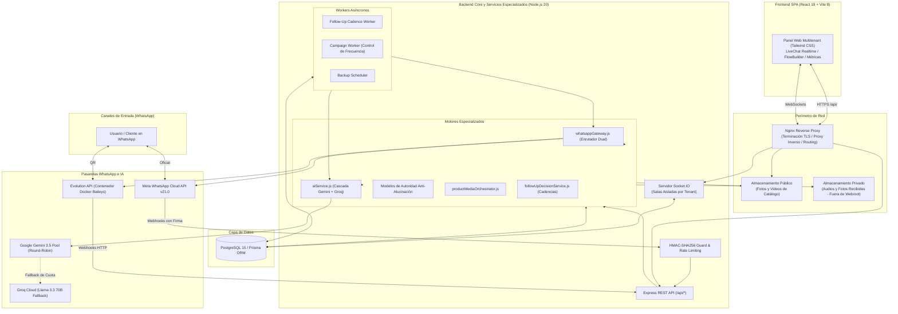

# Velion Agent — Technical Summary for Potential Acquirers

**Documento de Evaluación Técnica y Arquitectura para Socios, CTO y Equipo de Inversión**  
**Versión:** 1.0  
**Fecha:** Septiembre 2026  
**Clasificación:** Material Técnico Confidencial — Primera Ronda de Evaluación  

---

## 1. Qué es Velion Agent

**Velion Agent** es una plataforma SaaS B2B multitenant de **automatización comercial, ventas y atención al cliente a través de WhatsApp**, potenciada por Inteligencia Artificial Generativa y diseñada bajo estándares de fiabilidad empresarial.

A diferencia de los chatbots convencionales de mercado que funcionan como simples capas intermedias (*wrappers*) sobre modelos de lenguaje, Velion Agent resuelve los problemas estructurales que impiden a las empresas automatizar WhatsApp de forma segura:
1. **Eliminación de Alucinaciones Operativas:** Implementa modelos de autoridad deterministas a nivel de código que impiden que la IA invente números de cuenta bancaria, prometa políticas de entrega inexistentes o comprometa tiempos falsos de atención.
2. **Conectividad Dual WhatsApp:** Velion soporta conectividad mediante Meta Cloud API y, adicionalmente, una integración basada en sesión QR mediante Evolution API sobre un motor Baileys optimizado, permitiendo adaptar el canal de conexión a distintos escenarios operativos y habilitando la coexistencia con la aplicación móvil de WhatsApp Business.
3. **Orquestación Factual de Catálogo:** Envío de imágenes y videos oficiales de productos con rotación de galerías, deduplicación de álbumes de fotos y desambiguación de consultas de categoría.
4. **Motor Semántico de Seguimientos (*Sales Cadence Engine*):** Cadencias de recuperación de ventas abandonadas que analizan la intención del prospecto, respetan horarios silenciosos por zona horaria e interrumpen automáticamente el contacto ante compra o rechazo explícito.

El software se encuentra **desplegado y operativo en un entorno de producción controlado**.

---

## 2. Arquitectura de Alto Nivel

Velion Agent utiliza un diseño modular centrado en eventos en tiempo real, baja latencia y separación entre inquilinos corporativos:

---

## 3. Stack Tecnológico Verificado

Todo el stack corresponde estrictamente a tecnologías presentes y activas en el repositorio:

* **Frontend SPA:**
  * **Framework:** React 19.2 + Vite 8.1 (rendimiento óptimo y bajo tiempo de carga).
  * **Estilos:** Tailwind CSS 3.4 (interfaz moderna, adaptable y responsive).
  * **Enrutamiento:** React Router DOM v7 con control de acceso por roles (RBAC).
  * **Constructor Visual:** React Flow 11.11 para diseño interactivo de automatizaciones mediante nodos y conexiones.
  * **Comunicación en Tiempo Real:** Socket.IO Client 4.8 con gestión de reconexión automática.
  * **Iconografía y Tipografía:** Phosphor Icons, Lucide React y Google Fonts (Plus Jakarta Sans).
* **Backend Core y Servicios Especializados:**
  * **Entorno de Ejecución:** Node.js 20 LTS en modo nativo de módulos ES (`"type": "module"`).
  * **Servidor HTTP & Realtime:** Express 4.19 y Socket.IO 4.8.
  * **Capa de Datos:** Prisma ORM 5.22 sobre PostgreSQL 15.
  * **Seguridad:** Helmet 8.3, Express Rate Limit 8.6, JSON Web Tokens (jsonwebtoken 9.0), bcryptjs 3.0.
  * **Procesamiento Multimedia:** Sharp 0.35 (redimensionamiento y compresión de imágenes) y Fluent-ffmpeg / ffmpeg-static (transcodificación de notas de voz).
* **Integraciones de Inteligencia Artificial:**
  * **SDK Primario:** `@google/genai` v2.19 (SDK oficial de Google) consumiendo `gemini-3.5-flash-lite` y `gemini-3.5-flash` con *ThinkingLevel.MINIMAL*.
  * **SDK de Fallback:** OpenAI SDK 6.46 configurado hacia Groq Cloud (`llama-3.3-70b-versatile` o `qwen/qwen3.6-27b`) con adaptadores automáticos de herramientas (*function calling*).
* **Infraestructura y Despliegue:**
  * **Contenedores:** Docker y Docker Compose para el aislamiento de Evolution API y su base de datos auxiliar.
  * **Gestor de Procesos:** PM2 para clustering, balanceo y monitoreo continuo del backend.
  * **Servidor Web y SSL:** Nginx como proxy inverso, servidor estático y terminador TLS con Let's Encrypt Certbot.

---

## 4. Funcionalidades Principales de Negocio

1. **Aislamiento Multitenant:** Separación lógica y relacional entre inquilinos. Cada empresa administra sus propios contactos, conversaciones, catálogo, prompts, horarios de atención y cuotas comerciales.
2. **Conectividad Dual WhatsApp:** Velion soporta conectividad mediante Meta Cloud API (con Embedded Signup v4 y coexistencia con la app móvil de WhatsApp Business) y, adicionalmente, una integración basada en sesión QR mediante Evolution API, permitiendo adaptar el canal de conexión a distintos escenarios operativos.
3. **Cerebro Conversacional y Cascada de Resiliencia:** Pool de múltiples claves API de Gemini con rotación *round-robin*, clasificación semántica de errores y conmutación transparente a Groq ante límites de cuota (HTTP 429).
4. **Modelos de Autoridad Anti-Alucinación:**
   - `enforceBusinessAuthority`: Impide promesas de pago si no hay cuentas configuradas, bloquea afirmaciones de cobertura geográfica sin respaldo y elimina promesas falsas de tiempo de respuesta ("en 5 minutos").
   - `enforceMediaAuthority`: Verifica que la imagen o video realmente exista y haya sido despachada antes de permitir que la IA afirme haberla enviado.
5. **Catálogo y Carrito Conversacional:** Gestión de productos con múltiples imágenes, videos demostrativos, precios canónicos y promocionales. Generación atómica de pedidos (`Order` y `OrderItem`) con control de duplicados.
6. **LiveChat con Streaming en Tiempo Real:** Interfaz para agentes humanos con visualización de estados de entrega, reproducción de audios y panel lateral con notas y tareas operacionales.
7. **Human Handoff (Pausa Inteligente):** Detección de intenciones de queja o solicitud de operador humano que pausa automáticamente el bot durante 30 minutos y alerta al equipo.
8. **Motor Semántico de Cadencia (*Follow-Up Engine*):** Evaluación semántica con Gemini para reactivar prospectos según la etapa de compra, respetando horarios comerciales según la zona horaria del cliente y cancelando el seguimiento si el cliente compra.
9. **Campañas de Mensajería con Control de Frecuencia:** Programación de envíos con cadencia configurable de envíos (intervalos configurables de despacho de 5 a 15 segundos) y soporte de recurrencias quincenales y mensuales.
10. **Constructor Visual de Flujos (*FlowBuilder*):** Canvas gráfico para estructurar árboles de decisión con nodos de mensaje, delay, etiquetas, media y transferencia a humano.
11. **Módulo Operacional:** Registro de compromisos, recados y tareas operativas generadas por la IA o agentes, con cálculo de vencimiento en hora local del cliente.
12. **Panel de Control SuperAdmin:** Monitorización del clúster, control de inquilinos, límites de mensajes, presupuestos de tokens de IA y orquestador de respaldos de base de datos.

---

## 5. Métricas Técnicas Reales Verificadas en el Repositorio

| Métrica Auditada | Valor Real Verificado | Significado Técnico |
| :--- | :---: | :--- |
| **Líneas de Código de Aplicación** | **42,019 LOC** | 17,476 en Frontend SPA + 24,543 en Backend Core (sin incluir librerías ni tests). |
| **Líneas de Código de Tests y QA** | **45,185 LOC** | 39,272 en tests de dominio + 5,913 en QA Runner offline. La base de pruebas supera en volumen al código de aplicación. |
| **Historial de Commits** | **242 commits** | Historial documentado de estabilización, resolución de casos de borde y hardening en producción. |
| **Modelos Relacionales (Prisma)** | **16 modelos** | Estructura de datos completa (Tenants, Users, Chats, Messages, Orders, FollowUps, Products, etc.). |
| **Servicios de Backend Especializados** | **25 servicios** | Lógica de negocio modularizada en `backend_api/src/services/`. |
| **Controladores REST** | **17 controladores** | Enrutamiento desacoplado para cada dominio funcional. |

---

## 6. Seguridad y Privacidad de Datos

* **Aislamiento en WebSockets:** La pertenencia a salas de Socket.IO (`tenant:${tenantId}`) se deriva del contexto autenticado del JWT firmado, reduciendo el riesgo de accesos cross-tenant no autorizados.
* **Cifrado en Reposo (AES-256-GCM):** Los tokens de acceso de Meta y credenciales sensibles se almacenan en PostgreSQL cifrados con AES-256-GCM y etiquetas de autenticación para garantizar confidencialidad e integridad.
* **Validación Criptográfica de Webhooks:** El webhook de Meta implementa validación de firma HMAC-SHA256 en el backend (`metaWebhookAuth.js`) con comparación en tiempo constante (`crypto.timingSafeEqual`), neutralizando ataques de temporización (*timing attacks*). Nginx actúa en el perímetro realizando la terminación TLS y el enrutamiento hacia el backend.
* **Almacenamiento Seguro de Medios Privados:** Los audios y fotos recibidas de clientes se almacenan en `/var/lib/velion-inbound-media` (fuera de la raíz pública de Nginx) y solo pueden transmitirse mediante tokens JWT efímeros firmados con vigencia de 5 minutos.
* **Protección contra Inyecciones de Ruta:** Función determinista `ensurePublicMediaDir` que rechaza cualquier intento de *Path Traversal* en la carga de archivos.
* **Redacción Preventiva de Datos Financieros:** Anonimización automática de números de tarjetas de crédito y códigos CVV antes de enviar prompts a los proveedores de IA.

---

## 7. Calidad de Software y Estrategia de Pruebas (QA)

Velion cuenta con una batería de pruebas orientada a la confiabilidad funcional:
* **Network Guard Propio:** Un interceptor de red a nivel de sockets neutraliza cualquier llamada saliente a Gemini, Groq, Meta, Evolution o Stripe durante las pruebas. Esto permite ejecutar más de 40 suites de prueba en un entorno hermético sin invocar APIs externas de pago ni generar mensajes hacia usuarios reales.
* **Cobertura de Casos Complejos:** La suite automatizada aporta evidencia extensa de robustez funcional, cobertura de casos de borde, condiciones de carrera e idempotencia:
  - Ráfagas rápidas de mensajes donde el usuario cambia de opinión a mitad de turno (*stale generation race*).
  - Cancelación de respuestas si el usuario envía un nuevo mensaje mientras la IA estaba generando (*generation superseded guard*).
  - Idempotencia en creación de pedidos y asignación de precios canónicos.
  - Rotación determinista de galerías de fotos y deduplicación de álbumes.

---

## 8. Limitaciones Técnicas Actuales (Transparencia Total)

Para una evaluación justa y sin sorpresas en Due Diligence, se declaran las siguientes oportunidades de mejora:

1. **Facturación Actual con Conciliación Manual:** Aunque el backend cuenta con las librerías oficiales de Stripe instaladas y validación de webhooks, el frontend actualmente canaliza el cobro mediante un modal informativo de pago y confirmación por WhatsApp, tras lo cual un SuperAdmin activa el plan. Automatizar el cobro recurrente con Stripe Checkout o Mercado Pago requiere unas 30 a 40 horas de desarrollo.
2. **Onboarding Semi-Supervisado:** El alta de un nuevo tenant es rápida pero requiere que un administrador configure o apruebe los límites de la cuenta en el panel.
3. **Deuda Técnica en `whatsappController.js` (5,748 líneas):** Este archivo concentra la recepción de webhooks, lógica de turnos y llamadas a tools. Aunque es estable y cuenta con pruebas automatizadas, se recomienda modularizarlo en 4 controladores desacoplados para facilitar el trabajo simultáneo de varios desarrolladores.
4. **Arquitectura de Nodo Único (Single-Node):** La arquitectura actual está optimizada para operar inicialmente sobre un único VPS, con posibilidad de evolucionar hacia almacenamiento distribuido (ej. S3 / Cloudflare R2) y escalamiento horizontal de WebSockets mediante Redis Adapter según aumente la carga.

---

## 9. Transferibilidad y Continuidad Operativa

* **Código Fuente y Activos Preparados para Cesión:** Código fuente y activos propios preparados para cesión, sujetos al acuerdo contractual de adquisición y a la revisión de licencias/dependencias de terceros.
* **Cero Dependencia de Cuentas Personales:** La plataforma está diseñada para que el comprador aprovisione su propio servidor VPS, configure sus propios dominios y conecte sus propias cuentas de Meta for Developers y Google Gemini/Groq.
* **Procedimiento Documentado:** El proyecto cuenta con documentación de despliegue (`DEPLOYMENT_RUNBOOK.md`) para aprovisionar el sistema en un servidor limpio.

---

## 10. Clasificación de Madurez del Producto

* **Dictamen:** **Producto Funcional Avanzado / Operativo en Entorno de Producción Controlado**.
* **Fundamento:** Velion Agent supera ampliamente la etapa de prototipo o MVP. Cuenta con lógica transaccional madura, mitigación de alucinaciones comprobada, batería de pruebas de alta complejidad y estabilidad operativa demostrada. La incorporación del checkout automatizado de autoservicio consolidará su transición a un SaaS comercial maduro autónomo.
